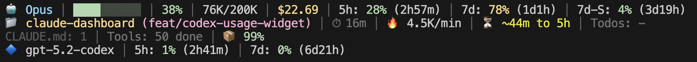

# claude-dashboard


Comprehensive status line plugin for Claude Code with context usage, API rate limits, cost tracking, and modular widget system.

## Demo


## Installation

**Requirements:** Claude Code v1.0.80+ / Node.js 18+

### From Plugin Marketplace

```
/plugin marketplace add uppinote20/claude-dashboard
/plugin install claude-dashboard
/claude-dashboard:setup
```

### Manual Installation

```bash
git clone https://github.com/uppinote20/claude-dashboard.git ~/.claude/plugins/claude-dashboard
/claude-dashboard:setup
```

## Display Modes

**Compact (1 line) - Default:**


> Model, context progress bar, cost, rate limits (5h/7d/7d-Sonnet) or z.ai usage (mutually exclusive by provider)

**Normal (2 lines):**


> Adds project info, session ID, session duration, burn rate, todo progress

**Detailed (4 lines):**



> Adds depletion time, config counts, tool activity, agent status, cache hit, Codex/Gemini usage

Multi-provider support: z.ai/ZHIPU, Codex, Gemini auto-detected when installed.

## Widgets

| Category | Widget | Description |
|----------|--------|-------------|
| **Core** | `model` | Model name with emoji, effort level for Opus/Sonnet (H/M/L), fast mode for Opus (↯) |
| | `context` | Progress bar, percentage, tokens (🟢 0-50% / 🟡 51-80% / 🔴 81-100%) |
| | `cost` | Session cost in USD |
| | `projectInfo` | Directory name + git branch (`*` if dirty) |
| **Rate Limits** | `rateLimit5h` | 5-hour rate limit with reset countdown |
| | `rateLimit7d` | 7-day rate limit (Max only) |
| | `rateLimit7dSonnet` | 7-day Sonnet limit (Max only) |
| **Session** | `sessionId` | Session ID (short 8-char) |
| | `sessionIdFull` | Session ID (full UUID) |
| | `sessionDuration` | Session duration |
| | `configCounts` | CLAUDE.md, rules, MCPs, hooks |
| **Activity** | `toolActivity` | Running/completed tools |
| | `agentStatus` | Subagent progress |
| | `todoProgress` | Todo completion rate |
| **Analytics** | `burnRate` | Token consumption per minute |
| | `cacheHit` | Cache hit rate percentage |
| | `depletionTime` | Estimated time to rate limit (approx)¹ |
| **Multi-CLI** | `codexUsage` | OpenAI Codex CLI usage (auto-hide if not installed)² |
| | `geminiUsage` | Google Gemini CLI - current model (auto-hide if not installed)³ |
| | `geminiUsageAll` | Google Gemini CLI - all models (auto-hide if not installed)³ |
| | `zaiUsage` | z.ai/ZHIPU usage (auto-hide if not using z.ai)⁴ |

> ¹ Assumes all utilization came from this session; improves as session runs longer.
> ² Auto-hides if `~/.codex/auth.json` not found. ³ Auto-hides if `~/.gemini/oauth_creds.json` not found. ⁴ Auto-hides if not detected via `ANTHROPIC_BASE_URL`.

i18n: English and Korean supported (auto-detect or set via setup).

## Configuration

```bash
# Preset modes
/claude-dashboard:setup compact             # 1 line (default)
/claude-dashboard:setup normal en pro       # 2 lines, English, Pro plan
/claude-dashboard:setup detailed ko max     # 4 lines, Korean, Max plan

# Custom mode: control widget order and line composition
# Format: "widget1,widget2,...|widget3,widget4,..." (| separates lines)
/claude-dashboard:setup custom auto max "model,context,cost|projectInfo,todoProgress"
```

**Plan differences:**

| Feature | Max | Pro |
|---------|-----|-----|
| 5h rate limit + countdown | ✅ | ✅ |
| 7d all models | ✅ | ❌ |

<details>
<summary><strong>Advanced Configuration</strong></summary>

**Interactive Mode:** Run `/claude-dashboard:setup` without arguments. Best for preset selection; for full widget control, use Direct Mode or edit the JSON file directly.

**Display Mode Presets** (`zaiUsage` and `rateLimit*` are mutually exclusive based on provider):

| Mode | Lines | Widgets |
|------|-------|---------|
| `compact` | 1 | model, context, cost, rateLimit5h/7d/7dSonnet, zaiUsage |
| `normal` | 2 | + projectInfo, sessionId, sessionDuration, burnRate, todoProgress |
| `detailed` | 4 | + depletionTime, configCounts, toolActivity, agentStatus, cacheHit, codexUsage, geminiUsage |

**Configuration file** (`~/.claude/claude-dashboard.local.json`):

```json
{
  "language": "auto",
  "plan": "max",
  "displayMode": "custom",
  "lines": [
    ["model", "context", "cost", "rateLimit5h"],
    ["projectInfo", "todoProgress"]
  ],
  "cache": { "ttlSeconds": 60 }
}
```

**Color Legend:** 🟢 0-50% Safe / 🟡 51-80% Warning / 🔴 81-100% Critical

</details>

## Commands

### `/claude-dashboard:setup`

Configure the status line display mode, language, and plan. See [Configuration](#configuration).

### `/claude-dashboard:check-usage`

Check usage limits for all AI CLIs (Claude, Codex, Gemini, z.ai) at once and get a recommendation for which CLI has the most available capacity.

```bash
/claude-dashboard:check-usage              # Interactive output with colors
/claude-dashboard:check-usage --json       # JSON output for scripting
/claude-dashboard:check-usage --lang ko    # Specify language
```


### `/claude-dashboard:update`

Update the plugin and refresh the statusLine path in settings. Run after updating via git pull or marketplace.

```bash
/claude-dashboard:update
```

## Troubleshooting

<details>
<summary><strong>Status line not showing</strong></summary>

1. Check if plugin is installed: `/plugin list`
2. Verify settings.json has statusLine config
3. Restart Claude Code

</details>

<details>
<summary><strong>Rate limits showing ⚠️</strong></summary>

- API token may be expired - re-login to Claude Code
- Network issue - check internet connection
- API rate limited - wait 60 seconds for cache refresh

</details>

<details>
<summary><strong>Wrong language</strong></summary>

Run setup with explicit language:

```
/claude-dashboard:setup normal ko  # Korean
/claude-dashboard:setup normal en  # English
```

</details>

<details>
<summary><strong>Cache issues</strong></summary>

API response cache is stored in `~/.cache/claude-dashboard/`. To clear:

```bash
rm -rf ~/.cache/claude-dashboard/
```

Cache files are automatically cleaned up after 1 hour.

</details>

## Development

```bash
npm install && npm run build
```

See [CONTRIBUTING.md](CONTRIBUTING.md) for details.

## Star History

[](https://star-history.com/#uppinote20/claude-dashboard&Date)

## License

MIT
